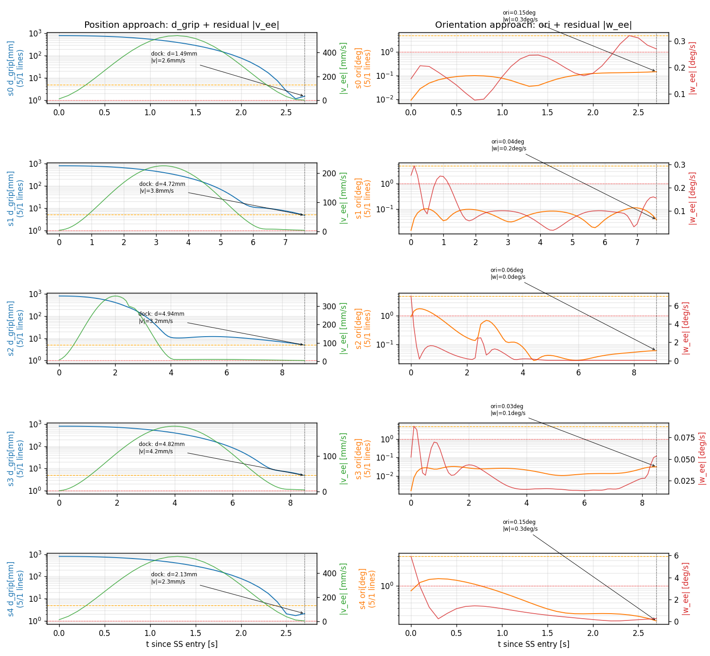
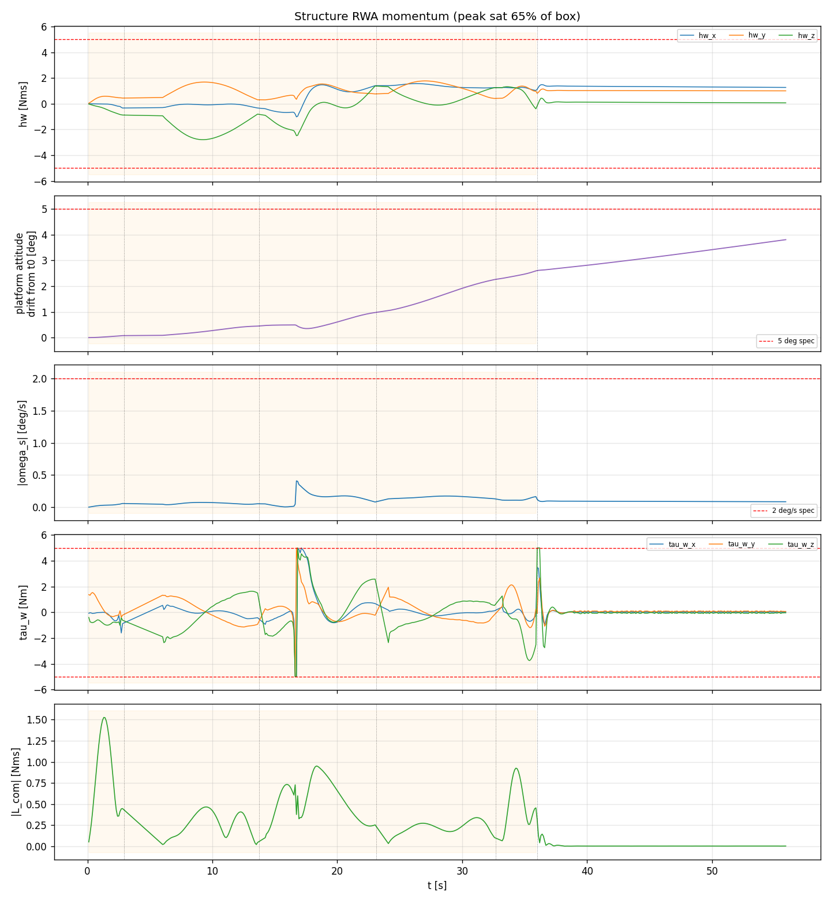
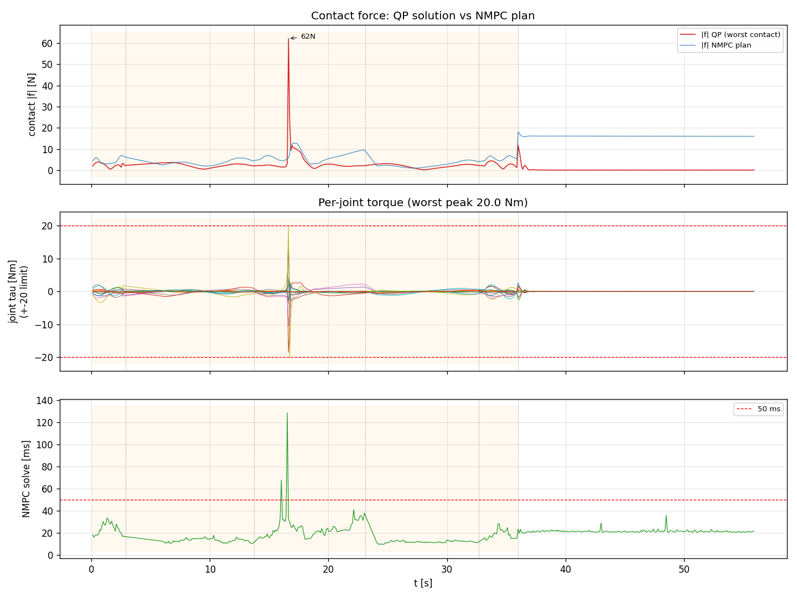
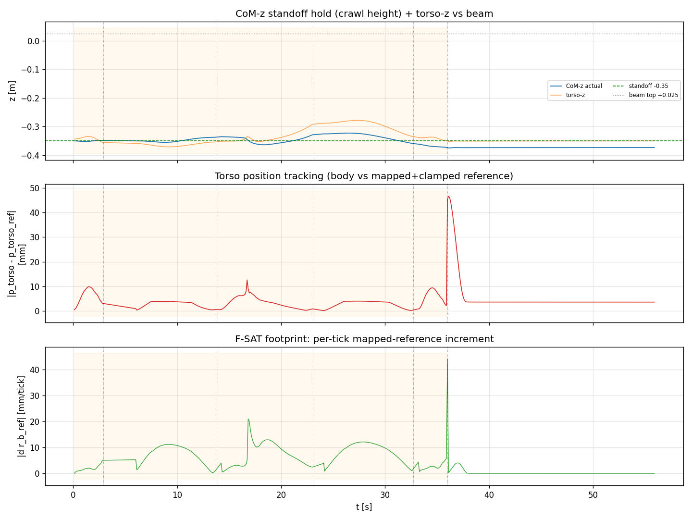

# Campaign — 5-Step Cooperative-Arms Traversal: results & dock validation

**Date:** 2026-05-27
**Branch:** `claude/rework-controller-tasks-0MAgl`
**Scenario:** `scripts/diag_cooperative_arms.py` (cooperative-arms mode, 1% mass-ratio canonical, anchor grid dx=0.8m, 6 anchors/arm).
**Companion:** `STACK_OVERVIEW.md` is the code-ground-truth reference for what each layer actually does. This file is the *results* trace.

---

## 1. Headline

The cooperative-arms traversal now **docks all 5 steps (0–4) end-to-end**, and the docking accuracy is **within the real HOTDOCK capture envelope** with margin. This is the first end-to-end traversal on this branch.

| | before campaign | after |
|---|---|---|
| steps docked | died at step 2 | **0,1,2,3,4** |
| regression | — | **212 passed, 1 deselected** (pre-existing FK) |
| crashes / QP-FAIL | — | 0 / 0 |

---

## 2. What was fixed to get here (commit trail)

| # | fix | commit |
|---|---|---|
| 1 | **F-SAT rate-cap rescale** — the torso-ref rate limiter was capped at the body's 2-tick startup distance (~0.125mm/tick), throttling sustained motion so the reference never reached the dock. Re-scaled to planned-reference velocity + jitter slack. Steps 0–3 then dock (was die@2). | `87a2661` |
| 2 | **Constant CoM-z standoff (−0.35m)** — the missing crawl-height spec; dock-IK + initial config pinned so the body holds a uniform standoff. Torso clearance −24mm→+259mm; CoM-z range 408mm→60mm. | `61c3d5a` |
| 3 | **Step-4 = 3 bugs, not control** (the EE reached the anchor; gate/dynamics bugs blocked it): (a) `_cache_site_ids` cached only anchors 1–5 → `_gripper_distance` returned inf for anchor 6 → dock gate never fired; (b) stale `tau=zeros(12)` (6-DOF) crashed terminal DS settle on `ctrl[:14]`; (c) `_coop_A_lin` UnboundLocalError in `settle_mode`. | `7ac9124` |
| 4 | **Dock-gate velocity guard** — gate was purely positional; added `|v_ee| < dock_vel_max` (0.01 m/s) clean-dock criterion. Verified no-op at current speeds. | `dfa541b` |

Earlier supporting: swing-reference logging clamp (`1d11c9d`, killed a phantom 820mm `e_ee_pos`).

---

## 3. Dock-quality results (verified fresh run)

Values at the dock instant, per step:

| step | swing | d_grip [mm] | ori [deg] | \|v_ee\| [mm/s] | \|a_ee\| [mm/s²] | torso travel [mm] |
|---|---|---|---|---|---|---|
| 0 | b | 1.49 | 0.15 | 2.6 | 94.9 | 22 |
| 1 | a | 4.72 | 0.04 | 3.8 | 3.8 | 553 |
| 2 | b | 4.94 | 0.06 | 3.2 | 2.5 | 522 |
| 3 | a | 4.82 | 0.03 | 4.2 | 3.3 | 690 |
| 4 | b | 2.13 | 0.15 | 2.3 | 117 | 42 |

**Interpretation:**
- **Velocity at dock is low** (2–4 mm/s) and **orientation tight** (≤0.15°) → gentle, well-aligned docks, not impacts.
- **Acceleration splits two regimes:** long strides (1–3) are *quiescent* at dock (a≈3 mm/s²) — a **settled steady-state ~4.8mm offset**; short steps (0,4) reach ~1.5–2mm but **mid-transient** (a≈100–600 mm/s²).
- Recoil (torso travel, 22–690mm) is the **intended locomotion**, not a dock impact — it does not correlate with dock acceleration.
- **Tightening to 1mm/1° is infeasible** with current control: the EE only transiently grazes its closest approach (1.15mm best) then drifts; a 1mm gate misses it (step 0 → TIMEOUT 26.7mm). Reverted to 5mm/5°.

Diagnostics: `scripts/diag_dock_quality.py`.

---

## 4. Realism benchmark vs HOTDOCK (the interface this system uses)

HOTDOCK (Space Applications Services; MOSAR/PERIOD) is validated to **mate from 23.5 mm lateral and 24° tilt misalignment**; its form-fit contour + chamfers mechanically guide/latch from there. Sister interface SIROM uses ~6–10 mm/s nominal capture approach velocity.

| quantity | our docks | HOTDOCK/SIROM | margin |
|---|---|---|---|
| lateral | ≤4.8 mm | **23.5 mm** capture | ~5× inside |
| angular | 0.15° | **24°** | ~160× inside |
| approach vel | 2–4 mm/s | ~6–10 mm/s | within/below |

**Conclusion: the docking is realistic and comfortably in-spec.** The current `weld_radius=5mm` gate is ~5× *stricter* than HOTDOCK — a conservative proxy. The ~4.8mm steady-state EE offset is **not a dockability problem** (it's ~20% of the real capture envelope). Chasing 1mm via control is the wrong goal — the real hardware captures these docks trivially.

Sources: Deremetz et al., "HOTDOCK: Design and Validation…" (ResearchGate 344871962); Space Applications Services HOTDOCK product page; MOSAR D2.7 HOTDOCK User Manual; PERIOD (OG12, DFKI); SIROM (SENER).

---

## 5. Group B — momentum / AOCS health (`scripts/diag_momentum_aocs.py`)

Checked against spec thresholds on the verified 5-dock run. **NB:** the
wheel box is **per-axis** (±5 each), so saturation = max over axes of
|·|, *not* the vector norm (the norm can reach 5√3≈8.66 with all 3
wheels at ±5 and zero per-axis violation — an earlier draft mis-reported
the norm as a 1.73 "FAIL").

| metric (per-axis) | value | thresh | pass |
|---|---|---|---|
| hw saturation peak | 0.559 (2.79/5 Nms) | <1.0 | ✓ |
| hw saturation rms (norm) | 0.376 | <0.7 | ✓ |
| platform rotation total | 3.80° | <5° | ✓ (76% of budget) |
| platform ω peak | 0.41°/s | <2°/s | ✓ |
| τ_w peak | 1.000 (5.0/5 Nm, **0 ticks over**) | <1.0 | at-limit |

**Verdict: momentum *state* healthy, margin eroding.**
- Wheels stay in box (per-axis 56% peak), ω_s gentle, L_com low (mean 0.25 Nms) — NMPC momentum constraint + AOCS keep the state feasible.
- **τ_w reaches the per-axis ±5 Nm wheel limit transiently** (saturation, **no over-command** — 0 per-axis violations) in two ~1s bursts: step-2 SS and step-4 end (norm there = 5√3 = all 3 wheels clamped). So **zero wheel-torque margin** during those windows. **The step-2 burst is the same disturbance event as that step's 62N contact-force spike** (longest stride, 522mm torso travel).
- **Platform attitude accumulates** monotonically to 3.8° over 5 steps (~0.76°/step → would breach 5° ≈ step 7, extrapolated).
- Both concerns expected to **worsen at 14% mass ratio** (untested).

## 6. Group D — actuator / solver health (`scripts/diag_actuator_solver.py`)

| check | result | verdict |
|---|---|---|
| NMPC solve <50ms | 99.6% (mean 19ms, peak 128ms) | ✓ (thresh 95%) |
| NMPC infeasible | 0% | ✓ (thresh <2%) |
| per-joint τ vs ±20Nm | worst joint **20.0 Nm (100%) for 2 ticks** | transient saturation |
| contact force QP vs NMPC plan | **62.2N QP vs 5.8N planned @ step2 (10.8×)** | cascade mismatch |

**B and D are the same step-2 transient (t≈16.63, longest stride), causally linked:** the **centroidal NMPC under-budgets the whole-body wrench ~10×** (its point-mass+momentum model has no arm/joint/torso inertial dynamics). So the real momentum disturbance exceeds the plan → **wheels saturate (B)**, a **joint hits 20Nm**, and the **QP commands 62N** — it docks, but with **zero actuator margin** in that ~1s window. This is the documented "QP needs ~9× more wrench than NMPC plans" (commit 673cc68), quantified at 10.8×. Root: the **soft-CoM residual** meant to keep NMPC↔QP consistent is **OFF** (`α_com_soft=0`).

## 6b. Group C — cascade band-aid footprint (`scripts/diag_cascade_health.py`)

The live SS cascade is **world-frame δ(q_current) + F-SAT rate clamp**
(not the principled loop-free mapping; see CLAUDE.md "Note —
reverted/superseded"). This measures how hard that band-aid works.

| check | result | verdict |
|---|---|---|
| CoM-z standoff hold (target −0.35), all steps | overall range **52mm**; per-step dev ≤ **27mm** (step 3 worst) | ✓ holds throughout |
| torso position tracking \|p_torso − p_torso_ref\| | mean **4.3mm**, peak 46.6mm (transient) | ✓ tracks mapped ref |
| F-SAT clip rate | **49.59%** of ticks clipped (1527/3079), max clip 10.2mm | band-aid works ~half the time |
| F-SAT per-tick increment \|d r_b_ref\| | peak 44.2mm/tick, mean 4.2mm/tick | δ(q_current) jitter |

Per-step CoM-z deviation from −0.35: step 0 → 2mm, step 1 → 13mm,
step 2 → 21mm, step 3 → 27mm, step 4 → 23mm. The standoff fix
(`61c3d5a`) was previously verified only at step 0; it **holds across
all 5 steps**.

**Verdict: the cascade *functions* but is *heavily band-aid-dependent*.**
The CoM-z standoff holds and the torso tracks the mapped+clamped
reference at ~4.3mm mean — so the body follows, it does not lag/drag.
But F-SAT is clipping **half** the ticks: the rate limiter is doing
sustained work suppressing the δ(q_current) feedback jitter, not just
catching occasional spikes. This is the **C-side of the same root
cause as B/D** — the live cascade survives on rate-clamping the
world-frame δ feedback rather than on the principled (loop-free)
mapping, which is committed OFF. The 49.6% clip rate quantifies the
**F-SAT / δ(q_current) debt**: the traversal is robust to it today,
but it is a standing liability (the band-aid, not a guarantee).

## 7. Verdict & open items

**Verdict:** end-to-end 5-step traversal **works**; dock **in-spec** (A); momentum **state** healthy (B); solver healthy (D) — but with **eroding actuator/momentum margin** concentrated in one step-2 transient, all rooted in a **10× NMPC↔QP wrench inconsistency** (soft-CoM cascade guarantee disabled).

**Campaign complete (A/B/C/D all measured).** C (§6b): CoM-z standoff
holds across all 5 steps (≤27mm dev); torso tracks the mapped ref
(mean 4.3mm); **F-SAT clips 49.6% of ticks** — the cascade functions
but leans heavily on the band-aid (the δ(q_current)/F-SAT debt,
quantified).

**Still pending:**
- Only the **1% mass-ratio canonical scenario**; 14% (spec T12) unchecked — B & D both indicate that's where margins bite.
- **FK-mode test** still red (deselected).

**Open control items (not blocking the traversal):**
- Settled **~4.8mm steady-state EE offset** on long strides (cooperative torso-linear vs EE tension).
- **10× NMPC↔QP wrench mismatch** under load (soft-CoM off) — the consistency guarantee the architecture was designed around is inactive; survives on QP slack.
- **Loop-free mapping angular drift** (committed OFF) — spec §3 constrained-dynamic-singularity; §6 mitigation never implemented.
- **F-SAT / δ(q_current) debt** — live cascade is the world-frame δ + F-SAT band-aid.
- **AOCS / actuator margin** — transient wheel + joint + contact saturation on the hardest stride; platform attitude accumulation ~0.76°/step.
