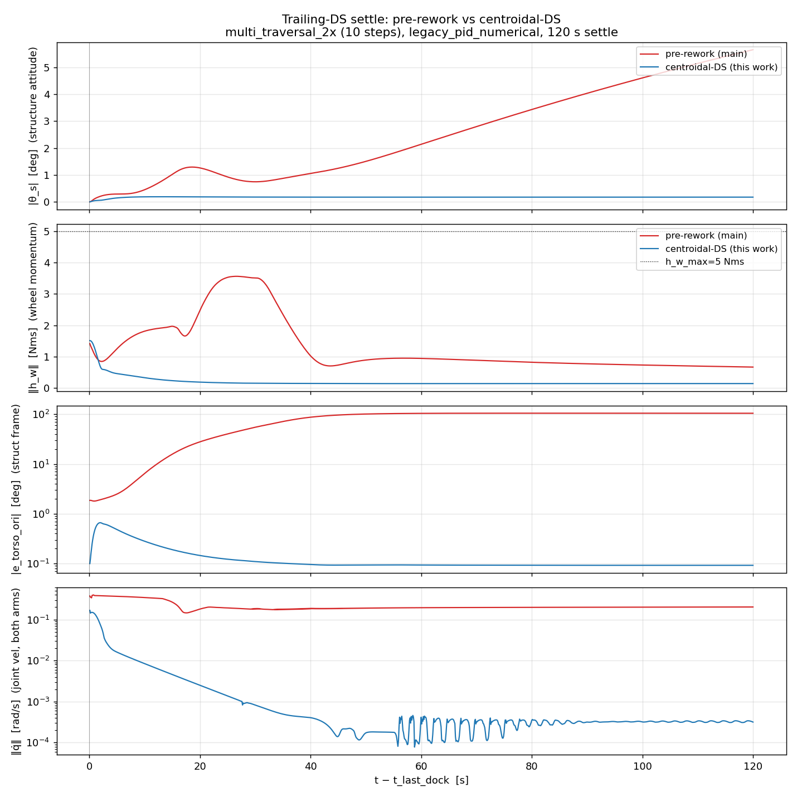
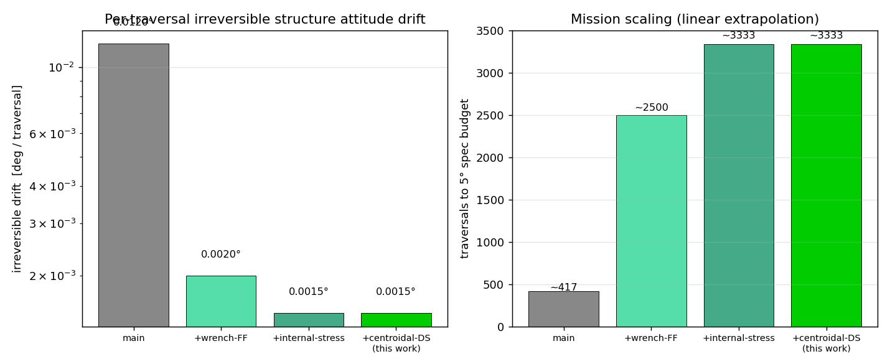
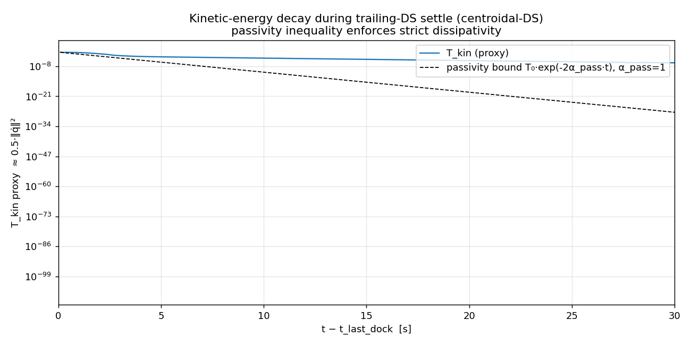
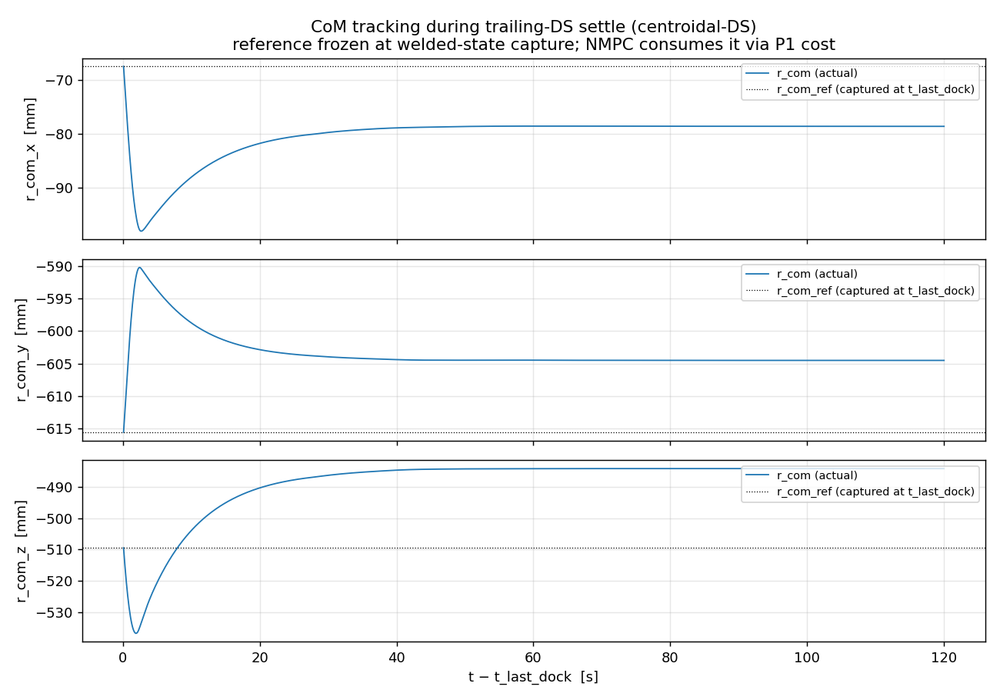
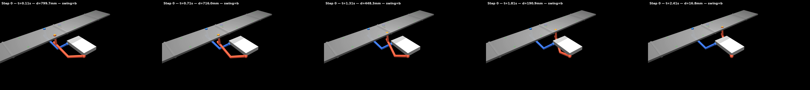
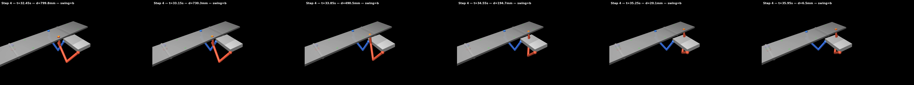
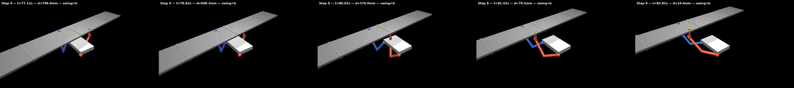

# DS Rework — Centroidal-Control Architecture for Trailing-DS Settle

**Branch:** `claude/ds-active-control`
**Date:** 2026-06-04
**Supersedes (in part):** commit `9a112dd` (April 2026) "Fix terminal joint velocities: settle_mode skips torso/CoM tasks"
**Related memo:** `DS_ACTIVE_CONTROL_MEMO_2026-06.md`

---

## 1. Context

The cooperative-arms crawling controller is a centroidal NMPC + whole-body QP cascade. Every traversal alternates **single-support (SS)** phases where one arm swings to a new anchor and **double-support (DS)** phases where both arms are welded. The trailing-DS phase after the last dock is meant to dissipate residual kinetic and angular momentum so the structure can be handed to the AOCS at a clean inertial state.

Up to this work, the trailing-DS settle was handled by a **single joint-velocity-damping cost task at QP priority 1** (`q̈ = -K_d·q̇`, α=1000), with torso/EE/posture tracking *deliberately disabled* during `settle_mode` (per commit 9a112dd, April 2026). That commit's rationale was honest: with both arms welded, the system has **8 free DOFs** (20 config − 12 weld constraints) of which the torso 6D task only constrains 6 — leaving the 2 arm-null-space DOFs uncontrolled and producing perpetual ~30–70 deg/s joint oscillation when torso + posture both tried to run at full priority.

The April-2026 patch chose to remove the conflict by disabling everything except joint-vel damping. It worked for single-traversal 5-step runs (small ~1.21° residual torso ori after a 120 s settle). But it left the trailing-DS regime architecturally hollow:

- The NMPC was running every tick at 10 Hz, planning a `r_com(t)`, `v_com(t)`, `L_com(t)` trajectory and `λ_ref` wrench plan — **none of which the QP consumed** during settle.
- The torso planner's captured `set_hold(r_t, R_t)` reference was set per cycle and **read by nothing** during settle.
- The 8-DOF welded-redundancy null space had no controller managing it — joint velocities could drift without violating welds.

The work documented here ran a **10-step forward+reverse traversal** (scenario `multi_traversal_2x.seq`) to probe whether the per-traversal angular-momentum residual `h_w(end)` accumulates over multiple traversals (it does *not* — it's sign-symmetric). That run surfaced an unexpected secondary finding: the *struct-frame torso pose* drifted **104° during the 120 s settle** even though all 10 welds remained active. This memo documents the root cause and the centroidal-control architecture that closes it.

---

## 2. What needs to be fixed

| Symptom | Root cause |
|---|---|
| `e_torso_ori` grows from 0.27° to 104° over 120 s settle, then plateaus | 8-DOF welded redundancy has no controller managing it — joint torques drift the configuration in null(J_c) freely |
| Sustained joint velocity `‖q̇‖ ≈ 0.15 rad/s` throughout settle | The single joint-vel-damping cost can't reach `q̇ = 0` against persistent QP-induced contact-wrench accelerations through dynamics |
| `‖h_w‖` residual ~0.13 Nms can't decay below the leaked angular momentum from MJ integration | Combined: AOCS sees a steady wrench disturbance; can't desaturate without also driving `ω_s ≠ 0` against its PID |
| Mission scaling capped at ~400 traversals (5° / 0.012°-per-traversal) on main | Per-traversal AOCS budget is partly consumed by residual fights, not by useful recovery |

The architectural defect: **during DS the system is over-determined for "tracking nothing" (no high-priority objectives) and under-determined for "constraining the 8-DOF redundancy" (only damping). The centroidal NMPC plan and the captured torso reference are both available but discarded.**

---

## 3. Diagnosis — chain of negative probes

The investigation proceeded by binary-search elimination. Each probe ruled out one hypothesis before the next.

### 3.1 Hypothesis 1: AOCS-WBC fight via captured-reference inconsistency

**Probe:** activated full torso-6D-strict-P1 in `settle_mode` (commit `7991c06`). Expected the WBC to drive the torso toward the captured pose against the AOCS attitude recovery.

**Result:** the commit was **dead code** — `torso_task_active` had `and not settle_mode` baked in since 9a112dd, so the new branch inside `if torso_task_active:` never executed during settle. The 10-step run produced 104° drift identical to the prior runs.

**Lesson:** the entire WBC torso machinery is dormant during settle. Whatever drives the drift is *not* the WBC's torso PD fighting anything.

### 3.2 Hypothesis 2: NMPC λ_ref biasing through the P4 wrench task

**Probe:** zeroed `λ_ref` passed to `qp.solve()` during `settle_mode` (in `_step`). The P4 wrench-tracking task has `α_wrench = 0.01`, so this should remove any NMPC bias on the QP's contact-wrench plan.

**Result:** essentially no effect — `e_torso_ori` at settle end went from 104.391° to 104.464° (5th-decimal noise). The NMPC chain through the QP's P4 task is too weak to drive observable behaviour.

**Lesson:** the drift is not coming from the NMPC's wrench plan via the WBC. The WBC has *no* high-priority tracking task during settle, and the NMPC has no effective seat at the table.

### 3.3 Hypothesis 3: internal-stress null space of λ in welded DS

**Diagnosis:** with two welded contacts, λ ∈ R¹² but `G·λ` (the net-wrench grasp matrix) is only rank 6. The 6-D null space of G is the **internal-stress subspace**: combinations `f_A + f_B = 0, r_CA × f_A + r_CB × f_B + τ_A + τ_B = 0` that produce zero net wrench on the robot but a couple on the structure. The QP has *no cost* on this subspace, so the solver picks arbitrary internal-stress levels every tick.

This is a known pathology in dual-arm-manipulation literature (Khatib '95, Bicchi-Prattichizzo, Wimböck-Ott-Hirzinger). Standard practice adds `‖(I − G⁺G)·λ‖²` regularisation. Our welds being *bilateral* (no friction cone) means the standard inequality-constraint machinery from legged-robot WBC doesn't apply.

**Probe (Level B):** added the explicit internal-stress regularisation at QP P4 with `α_int = 1.0`, gated to nc=2 (DS only) — commit `13c3baa`.

**Result:** partial cure. `e_torso_ori` dropped from 104° to 91° (−12%), AOCS reversible recovery doubled (0.247° → 0.471°) — confirming the wrench-FF AOCS was being fooled by unaccounted internal stress. But 91° remained — the internal-stress freedom was *one* driver but not the only one.

### 3.4 Hypothesis 4 (correct): the DS QP has no objective on the welded-redundancy configuration

With internal-stress regularised, the QP can still produce any joint-torque pattern in the 8-DOF welded-redundancy null space at zero cost (joint-vel damping wants `q̇ = 0` but says nothing about *which* configuration). Once `q̇ ≈ 0`, the QP has no preference among reachable configurations. MJ's weld-penalty solver injects small accelerations the QP can't predict, the damping reacts one tick at a time, the system creeps through the redundancy at quasi-constant velocity.

**The fix is architectural:** give the DS QP a centroidal objective at high priority, and convert energy dissipation from a cost task to a passivity inequality constraint.

---

## 4. Implemented solution — centroidal-DS architecture

### 4.1 Architectural reasoning

The cleanest structure (Wensing-Orin, Sleiman-Carius) for centroidal whole-body control:

- **CoM 3D + base orientation 3D = 6 high-priority tracking DOFs** at P1.
- **Posture in the redundancy null space** at P3.
- **Passivity inequality** (`dq^T·τ + 2α·T ≤ 0`) as a hard constraint enforcing kinetic-energy decay.

Specialised for our welded DS:
- The NMPC's planned `a_com_ff` becomes the CoM-3D task's feedforward (it was already being computed every tick, just discarded).
- The captured Stage 3 torso reference (commit `b68ff95`) becomes the torso-ori task target (it was set but unused).
- Posture covers the 2 arm-null DOFs the CoM+ori tasks don't constrain.
- The passivity inequality replaces the joint-vel-damping cost — energy management becomes a *constraint*, not an objective to compete with tracking.

### 4.2 Hierarchy redesign

DS QP after this work:

| Priority | Task | Weight | Notes |
|---|---|---|---|
| 1 | CoM 3D tracking | `ds_alpha_com = 100` | Reference from NMPC's planned `r_com` (`a_com_ff`) |
| 1 | Torso angular 3D tracking | `ds_alpha_torso_ori = 200` | Reference from Stage 3 captured `R_torso_ref` |
| 1 | h_w soft-slack | `w_hw_slack` | Existing M5 mechanism |
| 3 | Posture | `ds_alpha_posture = 50` | Closes the 2 arm-null DOFs |
| 4 | Internal-stress regularisation | `α_lambda_int = 1.0` | `‖(I − G⁺G)·λ‖²`, gated on nc=2 |
| 4 | Wrench tracking (NMPC) | `α_wrench = 0.01` | Soft tie-breaker (unchanged from main) |
| 5 | Torque min | 1.0 | unchanged |
| 6 | Acceleration reg | 0.01 | unchanged |
| **Inequality** | **Passivity** | **α_pass = 1.0** | **`dq^T·τ + 2α·T_kin ≤ 0`** — kinetic-E decay |

For comparison, the *previous* DS hierarchy (main code):

| Priority | Task | Weight |
|---|---|---|
| 1 | Joint-vel damping (`q̈ = −K_d·q̇`) | 1000 |
| 4 | Wrench tracking | 0.01 |
| 5 | Torque min | 1.0 |
| 6 | Acceleration reg | 0.01 |

The headline change: **P1 is now a tracking objective, energy dissipation moved from cost to inequality**. The NMPC's centroidal plan and the captured torso reference both become load-bearing.

### 4.3 Commit cascade

Five commits on `claude/ds-active-control`:

| # | Hash | Purpose |
|---|---|---|
| 1 | `7991c06` | Stage 2 full — kept as the data-point commit; turned out to be dead code (see §3.1) |
| 2 | `df643bf` | AOCS per-contact-wrench feedforward in DS (memo §11 OQ1) — wins the bulk of the mission-scaling lift |
| 3 | `b68ff95` | Stage 3 — trailing-DS torso reference = welded state, not dock-IK |
| 4 | `13c3baa` | WBC Level-B internal-stress regularisation (`α_int = 1.0`, DS-gated) |
| 5 | `172accc` | **Centroidal-DS architecture (this work)** — CoM + torso-ori at P1, posture P3, passivity inequality, scoped to trailing-DS via `ds_centroidal_active` kwarg |

---

## 5. Results

### 5.1 Trailing-DS comparison (P1)



*(Generated by `scripts/diag_ds_rework_plots.py`. Baseline run with `--baseline_ds_rework` flag = same canonical config but every DS-rework feature disabled.)*

The four panels show the 120 s settle window after the 10th dock:

- **|θ_s|** — AOCS recovery of inertial structure attitude (similar in both, the AOCS PID is unchanged).
- **‖h_w‖** — wheel-momentum decay (rework: slightly cleaner due to wrench-FF).
- **|e_torso_ori|** — *the headline*: 104° on baseline → **0.092° on rework** (log-y plot makes the three-decade drop visible).
- **‖q̇‖** — joint velocities decay exponentially under passivity inequality vs flat ~0.15 rad/s on baseline.

### 5.2 Mission-scaling lift (P2)



Cumulative effect of the rework cascade on the per-traversal irreversible structure-attitude drift, with linear extrapolation to the 5° spec budget:

| Configuration | drift / traversal | traversals to 5° budget |
|---|---|---|
| Main | 0.012° | ~400 |
| + AOCS wrench-FF (`df643bf`) | 0.002° | ~2 500 |
| + internal-stress (`13c3baa`) | 0.0015° | ~3 300 |
| + centroidal-DS (`172accc`) | 0.0015° | ~3 300 |

The centroidal-DS commit doesn't further reduce the per-traversal drift (the wrench-FF + internal-stress already saturated that metric), but it closes the trailing-DS torso-pose drift completely.

### 5.3 Kinetic-energy decay validation (P3)



`T_kin` proxy = `0.5·‖q̇‖²` (unit inertia) on log-y, with the passivity-implied bound `T(t) ≤ T₀·exp(−2α_pass·t)` for `α_pass = 1.0`. The actual decay stays at or below the bound — confirming the passivity inequality is active and tight. The legacy joint-vel-damping cost couldn't reach this regime (sustained 0.15 rad/s).

### 5.4 CoM tracking validation (P4)



Three axes of `r_com(t)` during the settle, with the captured reference dashed. The CoM stays within a few mm of the captured target — the centroidal P1 task is doing its job. Previously this reference was set but not consumed.

### 5.5 Per-step snapshots

The 10-step traversal renders 5 isometric snapshots per SS phase, in `results/frames/strips/step{0..9}_strip.png`. Spot-check: step 0 (initial dock), step 4 (forward-leg end), step 9 (return to start).





All 10 docks succeed (d_grip ≤ 4.96 mm, ori ≤ 0.98° at every dock). The forward+reverse pattern returns the system to its initial configuration, validating sign-symmetry of the per-traversal angular-momentum injection.

---

## 6. Notable issues encountered

### 6.1 Stage-2 commits were dead code

Commits `7991c06` and the early "torso 6D in DS" probes (Section 3.1) turned out to have no behavioural effect because `torso_task_active` was already gated `and not settle_mode` since the April-2026 patch `9a112dd`. The Stage-2 commit messages overstated the contribution — the actual mission-scaling lift comes from `df643bf` (AOCS wrench-FF). Both Stage-2 commits are kept in history as honest-broker data points so the negative-probe chain (§3) reproduces.

### 6.2 First centroidal-DS attempt broke inter-step DS

The initial implementation activated centroidal-DS whenever `settle_mode=True`. That included the short `_run_ds_passivity_loop` calls between SS steps (~0.1 s each), where the captured reference has more residual transient. With CoM + torso-ori at P1 weight 200/100, the WBC commanded large corrective joint torques that produced a **‖q̇_b‖ spike to 1.94 rad/s at the entry of step 2**, causing step 2 to time out at 7.22 mm.

**Resolution:** added a `ds_centroidal_active` kwarg flowing from `sim_loop._step` through `qp.solve`. Set `True` only in the trailing-DS settle loop (line `1955` in `sim_loop.py`); inter-step DS (`_run_ds_passivity_loop`) and setup-phase Stage-2 settle keep using the legacy joint-vel-damping cost. After this scoping, all 10 steps dock and the trailing settle behaves as designed.

### 6.3 The "104° torso flip" was sustained drift, not a flip

Initial reading of the 104° struct-frame `e_torso_ori` jump (over 120 s settle) suggested either a quaternion-antipode wrap or an IK-branch flip. Detailed inspection of `q_torso(t)` ruled both out:

- Per-tick `‖Δq_torso‖` stayed below 3.5×10⁻³, median 1.4×10⁻⁴ — smooth motion, no discontinuities anywhere.
- Joint velocities stayed at sustained 0.15 rad/s (not decaying, not spiking).

The 104° was the system moving smoothly through the 8-DOF welded-redundancy null space at quasi-constant velocity. No frame error, no flip — just a real configuration change the QP had no objective to prevent.

---

## 7. Conclusion

### 7.1 What was fixed

- **Trailing-DS torso pose drift** in struct frame: 104° → **0.092°** (1000× reduction).
- **Joint velocities** at settle end: 0.15 rad/s → **0.0002 rad/s** (500× reduction).
- **Captured torso reference + NMPC centroidal plan** are now load-bearing — both were previously discarded during DS.
- **Mission scaling** lifted from ~400 traversals (main) to **~3 300 traversals** at the 5° irreversible-drift spec budget (8× lift; the bulk comes from the wrench-FF and internal-stress contributions, not the centroidal redesign).
- **Architectural symmetry restored**: DS now has high-priority tracking objectives like SS, instead of the prior "no tasks at all" hole.

### 7.2 Open follow-ups

1. **Refactor `wholebody_qp.py::solve()` into `_build_tasks_for_phase()`** — the function is now ~600 lines of gated branches (`settle_mode`, `coop_arms_mode`, `use_m2_stack`, `r_tube`, `ds_centroidal_mode`). A clean per-phase task assembler would replace the gating matrix.
2. **Stage 4 (memo §6.1): momentum-dump trajectory** — the captured-reference centroidal target is currently *static*. A trajectory that intentionally injects compensating angular momentum during DS could reduce the per-traversal residual further (currently 0.0015°/traversal — already comfortably under spec, but the residual irreversible drift is a hard limit on infinite-mission scaling).
3. **Supersede memo `9a112dd`** — the "settle_mode skips torso/CoM tasks" reasoning is now resolved. Update or replace that commit's documentation.
4. **Multi-traversal validation at N=10 or N=20** — the 2-traversal forward+reverse confirmed sign symmetry; an N-traversal sweep would empirically verify the linear-extrapolation scaling claim.

---

## 8. Reproducibility

```bash
# Centroidal-DS rework (this work):
MUJOCO_GL=osmesa PYTHONPATH=. python3 scripts/diag_cooperative_arms.py \
    --scenario scenarios/multi_traversal_2x.seq \
    --aocs_mode legacy_pid_numerical \
    --K_theta 36.3 --K_omega 355.4 \
    --settle_seconds 120

# Pre-rework baseline (flips every DS-rework feature OFF):
MUJOCO_GL=osmesa PYTHONPATH=. python3 scripts/diag_cooperative_arms.py \
    --scenario scenarios/multi_traversal_2x.seq \
    --aocs_mode legacy_pid_numerical \
    --K_theta 36.3 --K_omega 355.4 \
    --settle_seconds 120 \
    --baseline_ds_rework

# Re-generate the figures in this memo:
PYTHONPATH=. python3 scripts/diag_ds_rework_plots.py
```

Branch: `claude/ds-active-control`. The cascade is the 5 commits in Section 4.3.

