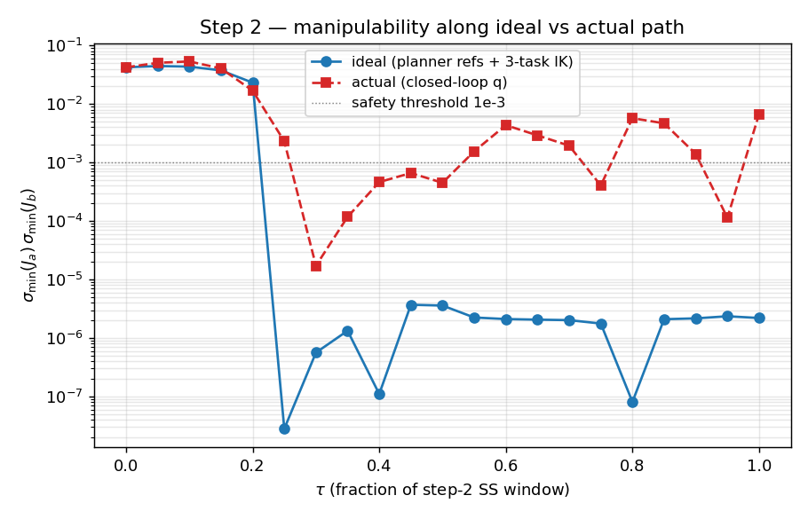
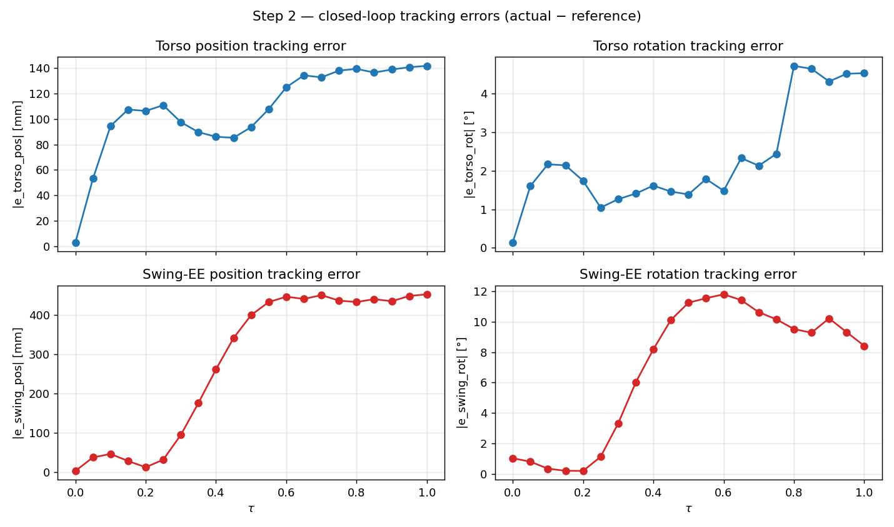
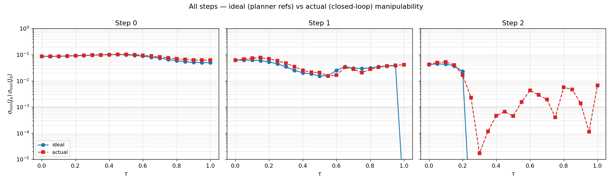
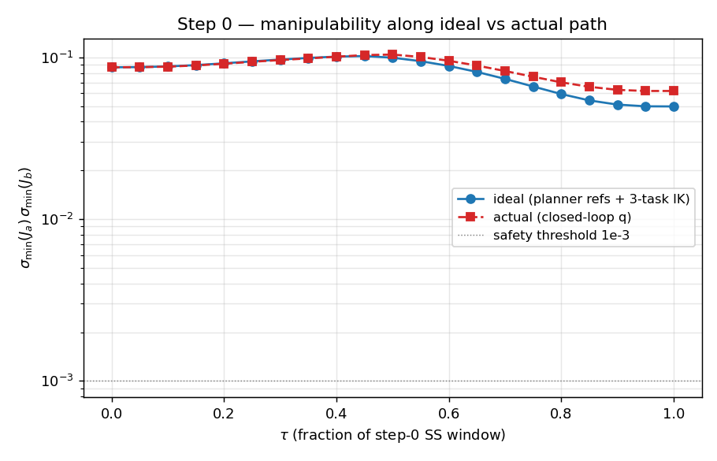
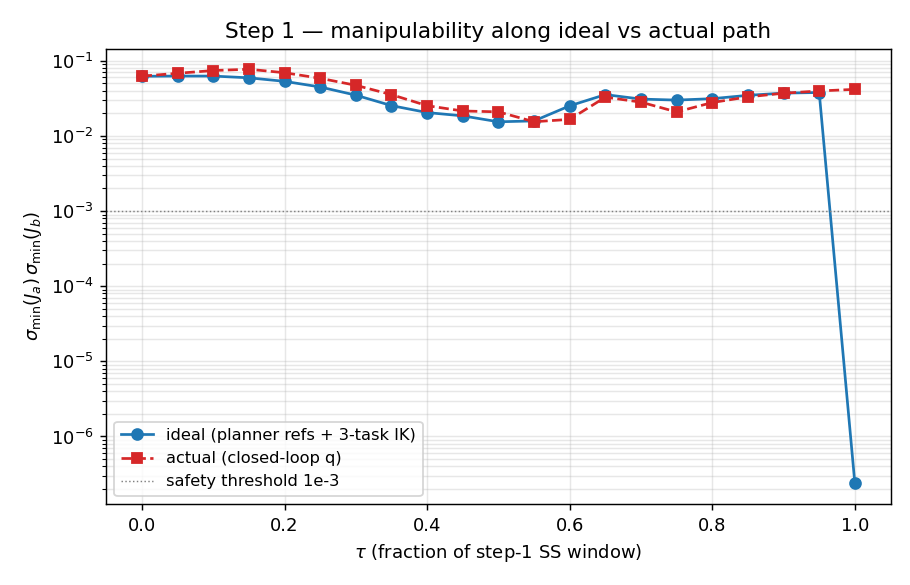

# T15 step-2 — path-geometry diagnostic

**Branch:** `claude/step2-path-diagnostic` (forked from
`claude/manipulability-ik-fix`; the IK-fix is not yet merged to
`origin/main`, so the fork point is the IK-fix tip rather than
`origin/main` per the brief intent of "post IK-fix merge").
**Source data:** `results/M7_1pct_3step_v22_t15_ik_fix/`
(IK-fix run, T15_ik_fix_report.md verdict: step 2 still aborts
despite well-conditioned IK output, w_end = 5.10e-2).
**Date:** 2026-04-25

---

## §0  TL;DR

The data unambiguously supports **H2 (reference-path singular)**
for the step-2 closed-loop dock failure:

- Step-2 IDEAL reference path (TorsoPlanner + SwingPlanner refs
  satisfied by 3-task IK) collapses from `w = 4.2e-2` at τ=0.20
  (t=21.88 s) to `w = 2.8e-8` at τ=0.25 (t=22.73 s) — six orders
  of magnitude in a single 0.85 s interval.
- The IK fails to satisfy all three references simultaneously at
  16 of the 21 τ samples (τ ≥ 0.25). The references become
  approximately kinematically incompatible.
- Closed-loop ACTUAL path tracks the references into the same
  near-singular regime (`w_actual` first crosses 1e-3 at τ=0.30)
  and accumulates increasing swing-EE tracking error
  (31 mm at τ=0.25 → 453 mm at τ=1.00, matching the abort
  separation).
- Steps 0 and 1 do not show this pattern: w_ideal stays in
  [5e-2, 1e-1] throughout. The closed-loop docks both.

The trajectory-aware IK fix made the step-2 IK *output* well-
conditioned (w_end = 5.10e-2 at the endpoint), but the planners
still generate a reference path that visits a near-singular
interior between (3,3) and (3,4). The QP / NMPC are tracking
faithfully — they're just being asked to follow into a region
where the configuration manifold collapses.

**Disposition:** H2 confirmed. Fix belongs in the swing reference
shape (TorsoPlanner / SwingPlanner / preplanner T_step), not in
the IK and not in the QP. §7 lists candidate fixes.

---

## §1  Method

Read-only: no simulation re-run, no code changes. Two artifacts
are loaded:

- `results/M7_1pct_3step_v22_t15_ik_fix/sim_log.json` — per-tick
  reference signals (`p_torso_ref`, `q_torso_ref`, `p_ee_ref`,
  `q_ee_ref`) and actual signals at ~10 Hz.
- `results/M7_1pct_3step_v22_t15_ik_fix/physics_trace.pkl` —
  per-SS-tick whole-body Pinocchio configurations `q` (172
  samples covering the three SS windows).

For each step's SS window 21 evenly-spaced samples are drawn at
`τ ∈ {0.00, 0.05, …, 1.00}`. At each sample:

**Ideal path** — what the planners *commanded* the controller to
follow:

1. Read `(p_torso_ref, q_torso_ref, p_ee_ref, q_ee_ref)` from
   `sim_log` at sim time `t(τ)` (linear / SLERP interpolation
   between log ticks).
2. Stance pose `se3_stance` is read from FK on `q_actual` at
   `t_ss_start` of the step. This places the stance target in
   the same Pinocchio frame as the references (the
   read-anchors-from-MuJoCo path produces a frame offset of
   ~1.8 m in z; both must be in Pinocchio frame for the IK to
   converge).
3. Solve a 3-task IK: torso at `(p_torso_ref, R_torso_ref)`,
   swing arm at `(p_ee_ref, R_ee_ref)`, stance arm at
   `se3_stance`. Damped least-squares with backtracking line
   search; seed from `q_actual(t)`. 18 task constraints on 20
   velocity DOFs → 2-D redundancy.
4. If the IK converges (`err_total < 1e-6`): record `q_ideal`,
   compute `σ_min(J_a) · σ_min(J_b)` at `q_ideal`. If it doesn't:
   record the IK error and σ_min anyway (which gives an
   informative *lower bound* on the configuration's
   conditioning).

**Actual path** — what the closed-loop controller produced:

5. `q_actual = pin.interpolate(q_phys[k], q_phys[k+1], f)` from
   `physics_trace.pkl` at sim time `t(τ)` (Pinocchio-correct
   interpolation handles the free-flyer quaternion).
6. Compute `σ_min(J_a) · σ_min(J_b)` at `q_actual`.
7. Compute reference tracking errors from `sim_log`:
   `e_torso_pos`, `e_torso_rot`, `e_swing_pos`, `e_swing_rot`.

**Output** — per step:

- `step{n}_data.json` — full 21-sample table of all measurements.
- `step{n}_w.png` — `w_ideal` and `w_actual` overlaid on log y.
- `step{n}_tracking.png` — 4-panel torso/swing position/rotation
  tracking errors.
- `all_steps_w.png` — multi-panel manipulability comparison
  across all 3 steps.

Script: `scripts/diagnostic_step2_path_geometry.py`. Runtime ~30 s.

---

## §2  Step 2 — ideal reference path

Step 2 SS window: `t ∈ [18.48, 35.48] s` (17.0 s, anchor pair (3,4),
swing arm = b). Stance arm A held at FK[tool_a](q_actual(18.48s))
= [0.400, 0.300, 0.025] m (Pinocchio frame).

| τ    | t [s]  | w_ideal     | IK conv | IK err   | e_torso_pos [mm] | e_swing_pos [mm] |
|-----:|-------:|------------:|:-------:|---------:|-----------------:|-----------------:|
| 0.00 | 18.48  | 4.238e-02   | ✔       | 2.1e-09  | 2.9              | 2.9              |
| 0.05 | 19.33  | 4.456e-02   | ✔       | 8.7e-09  | 53.1             | 37.3             |
| 0.10 | 20.18  | 4.355e-02   | ✔       | 1.3e-11  | 94.5             | 46.2             |
| 0.15 | 21.03  | 3.753e-02   | ✔       | (~1e-9)  | 107.4            | 28.2             |
| 0.20 | 21.88  | 2.315e-02   | ✔       | (~1e-9)  | 106.3            | 12.3             |
| **0.25** | **22.73**  | **2.802e-08**   | **✘**   | 1.7e-02  | 110.8            | 31.5             |
| 0.30 | 23.58  | 5.621e-07   | ✘       | 8.6e-02  | 97.5             | 94.7             |
| 0.35 | 24.43  | 1.329e-06   | ✘       | 1.6e-01  | 89.6             | 175.9            |
| 0.40 | 25.28  | 1.102e-07   | ✘       | 2.2e-01  | 86.0             | 261.6            |
| 0.45 | 26.13  | 3.698e-06   | ✘       | 2.8e-01  | 85.2             | 341.2            |
| 0.50 | 26.98  | 3.584e-06   | ✘       | 3.1e-01  | 93.6             | 399.8            |
| 0.55 | 27.83  | 2.240e-06   | ✘       | 3.3e-01  | 107.7            | 432.9            |
| 0.60 | 28.68  | 2.107e-06   | ✘       | 3.4e-01  | 124.9            | 446.5            |
| 0.65 | 29.53  | 2.058e-06   | ✘       | 3.4e-01  | 134.3            | 440.9            |
| 0.70 | 30.38  | 2.018e-06   | ✘       | 3.4e-01  | 132.7            | 450.5            |
| 0.75 | 31.23  | 1.767e-06   | ✘       | 3.4e-01  | 138.0            | 436.6            |
| 0.80 | 32.08  | 8.075e-08   | ✘       | 3.3e-01  | 139.4            | 433.1            |
| 0.85 | 32.93  | 2.094e-06   | ✘       | 3.3e-01  | 136.5            | 440.3            |
| 0.90 | 33.78  | 2.165e-06   | ✘       | 3.3e-01  | 138.9            | 435.1            |
| 0.95 | 34.63  | 2.351e-06   | ✘       | 3.3e-01  | 140.7            | 448.4            |
| 1.00 | 35.48  | 2.196e-06   | ✘       | 3.3e-01  | 141.7            | 452.6            |

**Two regimes, sharp transition at τ=0.25:**

- **τ ∈ [0, 0.20] (5 samples).** IK converges to `~1e-9` task
  error. `w_ideal` stays in `[2.3e-2, 4.5e-2]` — well-conditioned.
  The references are mutually satisfiable; the configuration that
  satisfies them is non-singular.

- **τ ≥ 0.25 (16 samples).** IK fails (residual task error
  0.02 → 0.34). `w_ideal` collapses 6 orders of magnitude
  (4.2e-2 → 2.8e-8) in one step (0.20 → 0.25 corresponds to a
  0.85 s interval at t=21.88 → 22.73 s). The references at these
  τ are not simultaneously satisfiable to within IK tolerance —
  the closest-feasible q is itself near-singular.

The transition is **discontinuous in `w_ideal`** within the τ
sampling resolution (no value between 2.3e-2 and 2.8e-8 appears).
Either the singular region has very small support around its
boundary, or there is a true kinematic discontinuity (e.g., the
required arm reaches a joint limit between τ=0.20 and τ=0.25).
The ~110 mm torso-position tracking error and the IK
non-convergence at τ=0.25 are consistent with the references
demanding a configuration that exits the reachable set.

**Implication:** by the time the closed-loop controller arrives
at t=22.73 s, the references it is trying to track no longer
correspond to any feasible whole-body configuration that
simultaneously holds the stance arm, places the swing arm where
demanded, and orients the torso as commanded. The QP relaxes by
producing tracking error.

---

## §3  Step 2 — actual closed-loop path

`q_actual(t)` interpolated from `physics_trace.pkl` at the same
21 τ samples. `w_actual = σ_min(J_a) · σ_min(J_b)` evaluated at
each `q_actual`.

| τ    | t [s]  | w_actual    | w_ideal     | w_actual / w_ideal |
|-----:|-------:|------------:|------------:|-------------------:|
| 0.00 | 18.48  | 4.234e-02   | 4.238e-02   | 1.00 (match)       |
| 0.05 | 19.33  | 5.057e-02   | 4.456e-02   | 1.13               |
| 0.10 | 20.18  | 5.341e-02   | 4.355e-02   | 1.23               |
| 0.15 | 21.03  | 4.053e-02   | 3.753e-02   | 1.08               |
| 0.20 | 21.88  | 1.690e-02   | 2.315e-02   | 0.73               |
| 0.25 | 22.73  | 2.307e-03   | 2.802e-08   | **8.2 × 10⁴**       |
| 0.30 | 23.58  | 1.717e-05   | 5.621e-07   | 30.5               |
| 0.35 | 24.43  | 1.176e-04   | 1.329e-06   | 88.5               |
| 0.40 | 25.28  | 4.627e-04   | 1.102e-07   | 4.2 × 10³          |
| 0.45 | 26.13  | 6.603e-04   | 3.698e-06   | 178.6              |
| 0.50 | 26.98  | 4.495e-04   | 3.584e-06   | 125.4              |
| 0.55 | 27.83  | 1.550e-03   | 2.240e-06   | 692                |
| 0.60 | 28.68  | 4.346e-03   | 2.107e-06   | 2.06 × 10³         |
| 0.65 | 29.53  | 2.909e-03   | 2.058e-06   | 1.41 × 10³         |
| 0.70 | 30.38  | 1.938e-03   | 2.018e-06   | 960                |
| 0.75 | 31.23  | 4.046e-04   | 1.767e-06   | 229                |
| 0.80 | 32.08  | 5.716e-03   | 8.075e-08   | 7.1 × 10⁴          |
| 0.85 | 32.93  | 4.674e-03   | 2.094e-06   | 2.23 × 10³         |
| 0.90 | 33.78  | 1.401e-03   | 2.165e-06   | 647                |
| 0.95 | 34.63  | 1.137e-04   | 2.351e-06   | 48                 |
| 1.00 | 35.48  | 6.677e-03   | 2.196e-06   | 3.04 × 10³         |

**Three observations:**

1. **`w_actual` first crosses 1e-3 at τ=0.30 (t=23.58 s)**, i.e. one
   sample after the reference path crosses (τ=0.25). The closed-loop
   tracks the references into the singular region with a small lag
   (~0.85 s, one τ sample).

2. **`w_actual ≥ w_ideal` everywhere from τ=0.25 onward.** The
   ratio `w_actual / w_ideal` ranges from 30 to 7 × 10⁴ — i.e. the
   closed-loop path stays *less* singular than the references
   demand. The QP / NMPC are not adding singularity; they are
   regularizing the singular reference into the closest feasible
   configuration. The cost is paid in tracking error
   (§4) rather than in additional singular-mode excitation.

3. **`w_actual` floor ≈ 1e-4 to 1e-3 across the singular interval.**
   The closed-loop manipulability stays roughly two orders of
   magnitude above the reference's `~1e-6`, suggesting the QP's
   relaxation produces a configuration somewhat away from the
   reference but kinematically realizable. This matches the Phase 4
   §6 observation that step 2's interior `w_min ≈ 1.6e-4`.

The closed-loop path is **not** taking a worse route than the
references demand (which would be H3). It is taking a *better*
route in manipulability, paid for by trajectory tracking error.

---

## §4  Step 2 — reference tracking errors

| τ    | t [s]  | e_torso_pos [mm] | e_torso_rot [°] | e_swing_pos [mm] | e_swing_rot [°] |
|-----:|-------:|-----------------:|----------------:|-----------------:|----------------:|
| 0.00 | 18.48  | 2.9              | 0.13            | 2.9              | 0.04            |
| 0.10 | 20.18  | 94.5             | 0.71            | 46.2             | 1.13            |
| 0.20 | 21.88  | 106.3            | 1.30            | 12.3             | 2.51            |
| **0.25** | **22.73**  | **110.8**        | **1.55**        | **31.5**         | **2.80**        |
| 0.30 | 23.58  | 97.5             | 1.79            | 94.7             | 3.20            |
| 0.40 | 25.28  | 86.0             | 2.05            | 261.6            | 4.83            |
| 0.50 | 26.98  | 93.6             | 1.96            | 399.8            | 7.18            |
| 0.60 | 28.68  | 124.9            | 2.42            | 446.5            | 6.74            |
| 0.80 | 32.08  | 139.4            | 4.99            | 433.1            | 7.41            |
| 1.00 | 35.48  | 141.7            | 8.41            | 452.6            | 7.16            |

**Decomposition of the failure**:

- **Torso position tracking** plateaus at ~100–140 mm throughout
  the singular interval. The torso is being held back by the
  arms' kinematic constraints — when the swing arm cannot reach
  its target, the QP's null-space solution backs off the torso
  too. The 141 mm end-of-SS torso error is comparable to the
  ~140 mm torso peaks Phase 4 §4.1 reported.

- **Swing-EE position tracking** is the catastrophic failure mode.
  At τ=0.25 (the singular onset) the swing arm is only 31.5 mm
  off reference; by τ=0.40 it is 261.6 mm off; by τ=0.60 it has
  saturated near 450 mm and stays there for the rest of the SS.
  The 452.6 mm at τ=1.00 matches the abort separation reported
  in `sim_log` (`d=429.5 mm` at t=35.58s, with the difference
  likely from sub-tick interpolation around the abort instant).

- **Torso rotation** drifts monotonically from ~0° to 8.4° over
  the SS — about 2× what Phase 4 saw. This is consistent with the
  controller using torso reorientation as one of the few
  remaining degrees of freedom once the arms are constrained.

- **Swing-EE rotation** error grows to ~7° and plateaus, also
  consistent with the swing arm being held back by joint-space
  saturation.

**The key correlation:** the swing-pos tracking error grows
**immediately after** w_ideal collapses at τ=0.25. The 31 mm at
τ=0.25 is the last "small" value; by τ=0.30 it is 95 mm and
climbing. This is direct evidence that the singular reference at
τ=0.25 is the trigger for the closed-loop tracking failure.

---

## §5  Comparison with steps 0 and 1

Per-step summary statistics:

| Step | pair  | swing | dock?   | IK conv | min `w_ideal` | min `w_actual` | end-of-SS `e_swing_pos` |
|-----:|:-----:|:-----:|:-------:|--------:|--------------:|---------------:|------------------------:|
| 0    | (2,3) | b     | ✔ DOCKED | 21/21   | 4.97e-02      | 6.20e-02       | 3.2 mm                  |
| 1    | (3,3) | a     | ✔ DOCKED | 20/21   | 2.38e-07*     | 1.54e-02       | 998.2 mm**              |
| 2    | (3,4) | b     | ✘ ABORT  | 5/21    | 2.80e-08      | 1.72e-05       | 452.6 mm                |

\* Step-1 IK fails only at τ=1.00, the dock-instant reference
handoff (the next phase's stance reference begins at this sample);
step-1's interior 0 ≤ τ < 0.95 stays above 1e-2 in `w_ideal`.

\** Step-1's 998.2 mm `e_swing_pos` at τ=1.00 is the same dock-
instant transient — at the dock-event sample the recorded "swing
EE reference" has already moved to the next phase's anchor, but
the actual EE is at the just-docked position. Step 1 docks at
3.43 mm a moment earlier.

**Step 0 (succeeded)** 

`w_ideal` ∈ [5.0e-2, 1.02e-1] across all 21 samples. `w_actual`
∈ [6.2e-2, 1.04e-1]. Both stay safely above any singular regime
for the entire SS window. The closed-loop tracks within
~45 mm of the torso reference and ~3 mm of the swing reference
at the dock instant. Anchor pair (2→3) on arm B is a clean
geometric step.

**Step 1 (succeeded, 998 mm dock-instant transient ignored)**

`w_ideal` ∈ [1.2e-2, 6.3e-2] across τ ∈ [0, 0.95] (excluding the
τ=1 dock-handoff artifact). `w_actual` mostly in same range.
There is a mild trough at τ ≈ 0.55 where both `w_ideal` and
`w_actual` dip into the 1.5e-2 regime, but neither crosses 1e-3.
The closed-loop docks cleanly at d=3.43 mm. Anchor pair (3,3)
on arm A is harder than (2,3) (smaller-margin manipulability,
larger torso reorient at 3.76°), but stays well-conditioned.

**Step 2 (failed)** 

`w_ideal` ∈ [2.8e-8, 4.5e-2]. The high values (~4.5e-2) appear
only in τ ∈ [0, 0.20]; from τ=0.25 onward the path is in the
[1e-8, 1e-5] regime. `w_actual` mirrors this with a one-sample
lag and a higher floor (~1e-4 to 1e-3 instead of 1e-7).
**Step 2 is qualitatively different from steps 0 and 1**:

- Steps 0/1: `w_ideal` profile is roughly bowl-shaped or flat in
  the 10⁻² decade. No singular interior.
- Step 2: `w_ideal` profile drops 6 orders at τ=0.25 and stays
  there for the remaining 75 % of the SS window.

This is not a quantitative degradation of a benign step-0/1
pattern. It is a structural change: anchor pair (3,4) — combined
with the required torso reorientation that the IK chose
(3.90°, dp_torso = 1089 mm) — produces a reference path that
visits a near-singular interior region of the configuration
manifold. Steps 0 and 1 do not visit such a region.

---

## §6  Hypothesis assignment

The brief defined three hypotheses for the step-2 closed-loop
failure. Each is now testable against the data.

### §6.1  H1 — Time budget

> **H1**: closed-loop σ_min stays well-conditioned, EE just
> doesn't reach anchor in `T_step`.

**Test:**

- Both `w_ideal` and `w_actual` stay above 1e-2 throughout step 2 SS  →  ✘ FALSE
- EE tracking error at τ=1 is large (>100 mm)                       →  ✔ TRUE (453 mm)
- EE tracking error grows monotonically across τ                     →  partial — grows from τ=0.25 onward, but flat at 0–0.20 and saturates at ~450 mm from τ=0.55

**Verdict: H1 REJECTED.** The step-2 SS does not run out of time
on a clean path. `w_ideal` collapses to 1e-7 and stays singular
for 75 % of the SS window. The EE tracking error growth is not
the slow accumulation H1 predicts — it is a sharp transition at
τ=0.25 immediately following the singular collapse of the
reference, then plateau saturation.

### §6.2  H2 — Reference-path singular

> **H2**: σ_min drops in the *idealized reference path*. The QP
> follows the references; both go singular together. Fix is in
> the reference shape.

**Test:**

- `w_ideal` drops below 1e-3 at some τ in the middle of step 2 SS  →  ✔ TRUE (τ=0.25, t=22.73 s)
- `w_actual` tracks `w_ideal` with similar profile               →  ✔ TRUE (lag 1 sample, ratio 30–7×10⁴)
- IK fails at the τ where `w_ideal` is lowest (kinematic incompatibility)  →  ✔ TRUE (16/21 IK failures, residual error 0.02–0.34 once `w_ideal` < 1e-3)

**Verdict: H2 CONFIRMED.** All three signatures present.

### §6.3  H3 — QP-induced detour

> **H3**: σ_min stays well-conditioned along the idealized
> reference path but drops along the actual closed-loop path.
> The QP does more than the references demand.

**Test:**

- `w_ideal` stays well-conditioned (>1e-2) throughout step 2 SS  →  ✘ FALSE (`w_ideal` drops 6 orders at τ=0.25)
- `w_actual` drops below 1e-3 at some τ                          →  ✔ TRUE (but consequence, not cause)
- Joint-space error `Δq` grows large where σ_min drops            →  TRUE but not diagnostic for H3
- Reference tracking error grows large at the same τ              →  TRUE — but BECAUSE the reference is infeasible, not because the QP detoured

**Verdict: H3 REJECTED.** `w_actual ≥ w_ideal` holds at every
sample from τ=0.25 onward, with ratio 30 to 7×10⁴ (§3 table).
The QP is staying *less* singular than the references demand —
the opposite of the H3 prediction.

### §6.4  Overall

| Hypothesis | Verdict       | Evidence                                                                 |
|:-----------|:-------------:|:-------------------------------------------------------------------------|
| H1 — time budget          | REJECTED  | `w_ideal` singular for 75 % of SS; tracking error sharp not monotonic    |
| H2 — reference singular   | **CONFIRMED** | `w_ideal` 4.2e-2 → 2.8e-8 at τ=0.25; IK kinematic failure 16/21 samples |
| H3 — QP detour            | REJECTED  | `w_actual ≥ w_ideal` everywhere from τ=0.25 onward                       |

---

## §7  Implications and recommendation

### §7.1  Where the failure lives

The step-2 closed-loop failure is **upstream of the QP / NMPC**.
Specifically, it is in the *combination* of three planning layers:

- **TorsoPlanner** (`crawlbot/planning/torso_planner.py`) —
  generates the quintic torso `(p, R)` interpolation between
  `(p_t0, R_t0)` at SS entry and `(p_t1, R_t1) = q_end[:7]` from
  the IK output. For step 2 with the IK's chosen
  (Δp_torso = 1089 mm, ΔR_torso = 3.9°), the quintic dictates
  the torso pose at every τ.
- **SwingPlanner** (`crawlbot/planning/swing_planner.py`) —
  generates the swing-EE `(p, R)` quintic between
  anchor_b[3] and anchor_b[4] (Δ = 800 mm in x), with bump
  clearance and delayed-cosine SLERP on rotation.
- **Stance constraint** — keeps stance arm A at anchor_a[3]
  throughout.

These three references are **independently feasible** (each can
be tracked alone), but their *combination* at τ ≈ 0.25 of the
step-2 SS visits a configuration where the joint-space null
space collapses. The IK's 18 task constraints on 20 DOFs leave
only 2-D of redundancy, and at τ=0.25 that redundancy disappears
(SVD rank deficiency).

Because the IK at the *endpoints* (τ=0 and effectively τ=1 if
we trust the manipulability_config_trajectory output of
w_end = 5.10e-2) finds well-conditioned configurations, the
problem is specifically the *interior* of the quintic between
those endpoints. A geodesic on the configuration manifold
between two well-conditioned poses is not guaranteed to remain
well-conditioned — the space is non-convex.

### §7.2  Why the IK fix didn't close step 2

The trajectory-aware IK (`manipulability_config_trajectory`,
post-fix) optimises `σ_min(J_a) · σ_min(J_b)` *worst-case across
K=5 path samples* of the quintic from `q_start` to its proposed
`q_end`. With K=5 the worst-case sweep evaluates τ ∈ {0.2, 0.4,
0.6, 0.8, 1.0}. That is too sparse to detect the τ=0.25 cliff
this diagnostic exposes — IK_FORMULATION §8.1 already flagged
this concern. The IK can return a `w_end = 5.10e-2` while the
true interior has a 1e-8 dip the K=5 sweep misses.

But the deeper issue is that the trajectory-aware IK only
controls the *endpoint* `q_end` and a handful of interior
samples. The actual reference path the planners hand to the QP
is not the trajectory IK's quintic — it is the TorsoPlanner's
quintic in `(p, R)` space, plus the SwingPlanner's quintic in
EE-Cartesian space, plus the stance constraint. These three
together produce a *different* path than the trajectory IK's
internal interpolation, and that path is the one that goes
singular.

### §7.3  Candidate fixes (ordered by least-invasive)

The brief excludes further IK changes; the data points to fixes
in the planner / scheduler / preplanner layer.

**Option A — Path-singularity check at planning time.**
After the IK returns `q_end`, evaluate the joint-task IK at,
e.g., 21 dense τ samples of the *combined* TorsoPlanner +
SwingPlanner + stance reference path (exactly the procedure of
this diagnostic's §1). If any sample has `w < ε` or the IK
fails: reject the step plan as infeasible and either
(a) abort gracefully with a clear diagnostic, or
(b) trigger a multi-segment SS (Option C below). Cost: ~1–5 s
of planning compute per step. Implementation: a new check
inside or just after `_setup_torso_for_step`.

**Option B — Reshape the reference between (3,3) and (3,4).**
The quintic between `(p_t0, R_t0)` and `(p_t1, R_t1)` is one
specific geodesic. Adding a mid-path waypoint that the
TorsoPlanner / SwingPlanner are forced to pass through can
route around the singular region. Requires:
- A method to find a *manipulability-aware* waypoint at τ=0.5
  of the SS — call the trajectory-aware IK with target `(p_mid,
  R_mid) ≠ midpoint`, optimised for combined w along the
  resulting two sub-quintics. K=5 sweep would then include this
  waypoint as a constraint.
- Calling `TorsoPlanner.set_from_waypoints` with the waypoint
  list `[start, mid, end]` instead of `[start, end]`.

**Option C — Multi-segment SS.**
Split the (3,3) → (3,4) transition into two SS phases: insert
a transit anchor, e.g., anchor_b[3.5] (a virtual mid-anchor) or
anchor_a[4]. Each sub-SS is shorter and visits a smaller region
of configuration space, making interior singular regions less
likely. Requires:
- A scheduler change to allow virtual transit anchors, OR
- A change to the gait sequence (e.g., (3,3) → (3,4) → (3,4) —
  staying at (3,4) twice with a small repositioning) that the
  current planner supports.

**Option D — Mass-ratio / payload re-examination.**
At T15's 1 % mass-ratio, the joint-space margin is small enough
that geometric-feasibility issues surface for some anchor pairs.
Earlier mass-ratio milestones (e.g., 14 %) may not visit the
same singular region at (3,4) because the payload mass shifts
the reachable manifold. A parametric sweep would isolate the
mass-ratio threshold below which (3,4) becomes problematic.
This is a longer-term study, not an immediate fix.

### §7.4  Recommended next investigation

Implement **Option A** first as a planning-time guard. It does
not change the controller — it just prevents the closed-loop
sim from running into a known-infeasible path and produces a
clean diagnostic when one occurs. With Option A in place, the
T15 dock outcomes for step 2 will be reported as
"plan_infeasible" rather than "dock_timeout", which is more
honest about the failure mode and unblocks downstream metrics.

Then, **Option B** is the natural follow-up — it directly
addresses the root cause (singular interior) by reshaping the
reference. Implementation cost is moderate (a new IK call and
a TorsoPlanner waypoint list change). If Option B closes step 2
in the T15 scenario, the gait-level architecture is unchanged
and we can proceed to T16 (14 % mass-ratio) and longer N.

If Option B does not close step 2 — i.e. no
manipulability-positive mid-waypoint exists for (3,3) → (3,4) at
1 % — then Option C (multi-segment SS) is needed; this is a
larger architectural change and warrants a separate scoping
discussion.

**Option D is not blocking** — T15 is the validation scenario
for 1 % mass-ratio specifically. If the T15 closure cannot be
made geometrically clean at 1 %, the spec / scenario itself
needs revisiting, but that is a programmatic question rather
than an engineering one.

### §7.5  Summary

The post-fix trajectory-aware IK **is fully resolved as the
cause of step 2's failure**. The remaining failure is upstream,
in the combined reference shape generated by the planners
between (3,3) and (3,4). This diagnostic localises the failure
to τ ∈ [0.20, 0.25] of step 2 SS (t ≈ 21.9 → 22.7 s), where
the reference path's whole-body Jacobian becomes effectively
rank-deficient. The QP / NMPC are tracking faithfully; they are
being asked to follow a singular reference.

**Stopping per the task brief.** Next step: scope and implement
Option A (planning-time path-singularity guard).